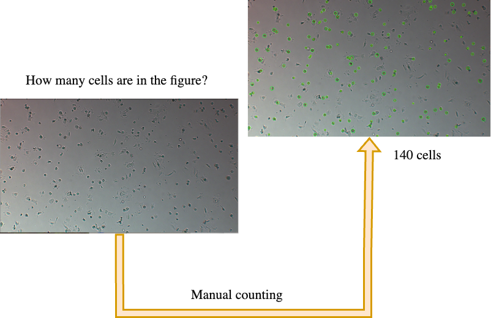
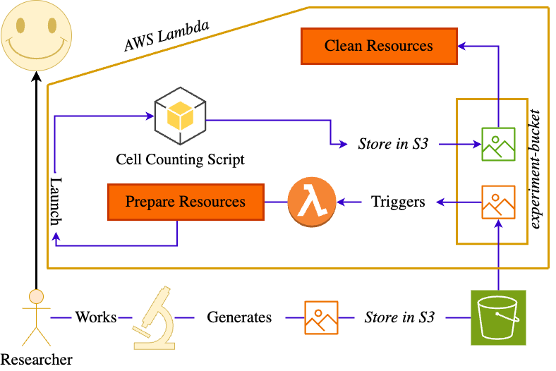

# AWS Lambda

AWS Lambda és un servei de computació sense servidor que executa el codi en resposta a esdeveniments i gestiona els recursos de computació necessaris. Aquest servei permet executar codi sense aprovisionar ni gestionar servidors.


Per exemple, podem guardar les nostres fotografies familiars a un bucket de S3 i crear una funció Lambda que redimensioni les imatges, apliqui filtres o qualsevol altra tasca que necessitem. Aquesta funció Lambda s'executarà cada vegada que es carregui una imatge al bucket de S3.

## Cas d'ús bioinformàtic

Un laboratori podria voler automatitzar el procés de comptatge de cèl·lules en imatges de microscopi. Això es pot aconseguir amb AWS Lambda i un contenidor Docker amb python i les llibreries necessàries.



Una forma simple d'automatitzar aquest procés és implementar un algorisme que compti les cèl·lules en una imatge de microscopi. Per exemple, podem utilitzar l'algorisme de transformada de Hough per detectar cercles en una imatge:

```python
import cv2
# Load the image
image = cv2.imread('image.png') 
# Convert the image to grayscale
gray = cv2.cvtColor(image, cv2.COLOR_BGR2GRAY) 
# Apply Gaussian blur
blurred = cv2.GaussianBlur(gray, (5, 5), 0) 
# Apply Hough transform
circles = cv2.HoughCircles(blurred, cv2.HOUGH_GRADIENT, dp=1
minDist=20, param1=50, param2=30, minRadius=5, maxRadius=30)
# Count the cells
print('Cell count:', len(circles))
```

Si volem automatitzar aquest procés, podem utilitzar AWS Lambda per a processar les imatges de microscopi i comptar les cèl·lules. De manera que cada vegada que es carregui una imatge al bucket de S3, la funció Lambda s'executarà i comptarà les cèl·lules en la imatge.  Si tenim *dockeritzat* el nostre codi, podem utilitzar un contenidor Docker per assegurar que tot l'entorn de Python i les llibreries necessàries estiguin disponibles en cada execució de la funció Lambda.



## Pasos per a implementar-ho

1. Crea dos buckets S3:
   - **microscope-images-nom**: Per a les imatges originals.
   - **microscope-images-processed-nom**: Per a les imatges processades.

2. Crea una funció Lambda que s'executi cada vegada que es carregui una imatge al bucket `microscope-images-nom`. Aquesta funció processarà les imatges utilitzant Python i les llibreries necessàries i carregarà les imatges processades al bucket `microscope-images-processed-nom`.

3. Per fer-ho, crea una carpeta anomenada `cell-counting` amb els següents fitxers:
    - `lambda_function.py`: Conté el codi de comptatge de cèl·lules.
    - `Dockerfile`: Conté les instruccions per construir la imatge Docker.
    - `requirements.txt`: Conté les llibreries necessàries pel script.
    - `entrypoint.sh`: Conté la comanda a executar quan el contenidor s'inicia.

    ```plaintext
    cell-counting/
    │
    ├── lambda_function.py   # Script Python per comptar cèl·lules
    ├── Dockerfile           # Fitxer per construir la imatge Docker
    ├── requirements.txt     # Llibreries necessàries (per exemple, opencv-python)
    └── entrypoint.sh        # Script d'inici del contenidor
    ```

    - `lambda_function.py`:
  
        ```python
        import boto3
        import cv2
        import os
        import numpy as np
        import matplotlib.pyplot as plt

        def handler(event, context):

            # Set the matplotlib config directory to /tmp
            # This is required to avoid permission issues when saving the plot

            os.environ['MPLCONFIGDIR'] = '/tmp/matplotlib'
            output_bucket = os.environ['DST_BUCKET']

            s3 = boto3.client('s3')
            input_bucket = event['Records'][0]['s3']['bucket']['name']
            input_key = event['Records'][0]['s3']['object']['key']
            filename = os.path.basename(input_key)
            local_path = '/tmp/' + filename

            s3.download_file(input_bucket, input_key, local_path)

            image = cv2.imread(local_path, cv2.IMREAD_COLOR)
            gray = cv2.cvtColor(image, cv2.COLOR_BGR2GRAY)
            blurred = cv2.GaussianBlur(gray, (5, 5), 0)
            circles = cv2.HoughCircles(blurred, cv2.HOUGH_GRADIENT, dp=1, minDist=20, param1=50, param2=30, minRadius=5, maxRadius=30)

            if circles is not None:
                circles = np.round(circles[0, :]).astype("int")

                # Loop over the (x, y) coordinates and radius of the circles
                for (x, y, r) in circles:
                    # Draw the circle in the output image, then draw a rectangle
                    # corresponding to the center of the circle
                    cv2.circle(image, (x, y), r, (0, 255, 0), 4)
                    cv2.rectangle(image, (x - 5, y - 5), (x + 5, y + 5), (0, 128, 255), -1)

            # Create a plot 
            fig = plt.figure()
            plt.imshow(cv2.cvtColor(image, cv2.COLOR_BGR2RGB))
            plt.axis('off')
            output_path = '/tmp/' + filename + '_processed.jpg'
            plt.savefig(output_path)

            s3.upload_file(output_path, output_bucket, filename + '_processed.jpg')

            return {
                'statusCode': 200,
                'body': {"message": "Image processed and uploaded to S3!, Number of cells: " + str(len(circles))}
            }
        ```

    - `requirements.txt`:

        ```plaintext
        opencv-contrib-python
        pandas
        boto3
        numpy
        matplotlib
        setuptools
        ```

    - `entrypoint.sh`:

        ```bash
        #!/bin/sh
        if [ -z "${AWS_LAMBDA_RUNTIME_API}" ]; then
        exec aws-lambda-rie python -m awslambdaric $@
        else
        exec python -m awslambdaric $@
        fi
        ```

    - `Dockerfile`:

        ```Dockerfile
        # Use the provided base image
        FROM public.ecr.aws/lambda/provided:al2023

        RUN dnf install -y awscli

        # Copy requirements.txt
        COPY requirements.txt ${LAMBDA_TASK_ROOT}

        RUN dnf install libglvnd-opengl libglvnd-glx python3-pip -y

        # Install dependencies and the Lambda Runtime Interface Client
        RUN pip install -r requirements.txt && \
            pip install awslambdaric

        # Copy function code and entrypoint script
        COPY lambda_function.py ${LAMBDA_TASK_ROOT}
        COPY entrypoint.sh ${LAMBDA_TASK_ROOT}

        # Make entrypoint script executable
        RUN chmod +x entrypoint.sh

        # Set the ENTRYPOINT to the custom entrypoint script
        ENTRYPOINT [ "./entrypoint.sh" ]

        # Set the CMD to the handler for your Lambda function
        CMD [ "lambda_function.handler" ]
        ```

1. Construeix la imatge amb la comanda:

    ```bash
    docker build -t cell-counting .
    ```

2. Crea un repositori ECR amb el nom `cell-counting`.

3. Inicia sessió a ECR amb la comanda:

    ```bash
    aws ecr get-login-password --region us-east-1 | docker login --username AWS --password-stdin <id>.dkr.ecr.us-east-1.amazonaws.com
    ```

4. Etiqueta la imatge amb la comanda:

    ```bash
    docker tag cell-counting:latest <id>.dkr.ecr.us-east-1.amazonaws.com/cell-counting:latest
    ```

5. Puja la imatge a ECR amb la comanda:

    ```bash
    docker push <id>.dkr.ecr.us-east-1.amazonaws.com/cell-counting:latest
    ```

    > **Nota**: AWS us indicarà dels passos 6, 7 i 8 la comanda exacta a executar.

6. Creació de la funció Lambda:

   - Ves al servei Lambda.
   - Clica **Crea funció** i selecciona **Imatge de contenidor**.
   - Configura:
        - *Nom de la funció*: cell-counting.
        - *URI de la imatge del contenidor*: Selecciona la imatge cell-counting d'ECR.
        - *Arquitectura*: arm64.
        - *Rol d'execució*: Utilitza un rol com **LabRole** amb permisos S3.
  
7.  Configura el disparador de la funció Lambda:

    - Clica a la funció cell-counting.
    - Clica a **Afegeix disparador**.
    - Selecciona **S3**.
    - Configura:
        - *Bucket*: microscope-images-nom.
        - *Tipus d'esdeveniment*: PUT.
    - Configura les variables d'entorn:
        - *MPLCONFIGDIR*: /tmp/matplotlib.
        - *DST_BUCKET*: microscope-images-processed-nom.
    - Ajusta els recursos de la funció:
        - *Memòria*: 1024 MB.
        - *Temps d'execució màxim*: 1 minut.
        - *Emmagatzematge temporal*: 512 MB.

8.  Prova la funció Lambda:

    - Puja una imatge al bucket `microscope-images-nom`.
    - Revisa el resultat al bucket `microscope-images-processed-nom`.
    - Pots trobar imatges reals al campus virtual.
