# Configuració VPN

En aquest punt, la vostra arquitectura permet als usuaris des de l'exterior a través d'internet mitjançant:

- El DNS públic del Load Balancer d'aplicacions (ALB) que redirigeix el tràfic HTTP i HTTPS a les instàncies EC2.
- El DNS públic de les instancies EC2 que despleguen el servei de WordPress.

Per solucionar-ho, actualitzarem el grup de seguretat de les instàncies EC2 per permetre el tràfic al port 80 únicament provinent del Load Balancer d'aplicacions (ALB). Això significa que les instàncies EC2 només acceptaran tràfic HTTP del Load Balancer d'aplicacions (ALB) i no de qualsevol altre origen.

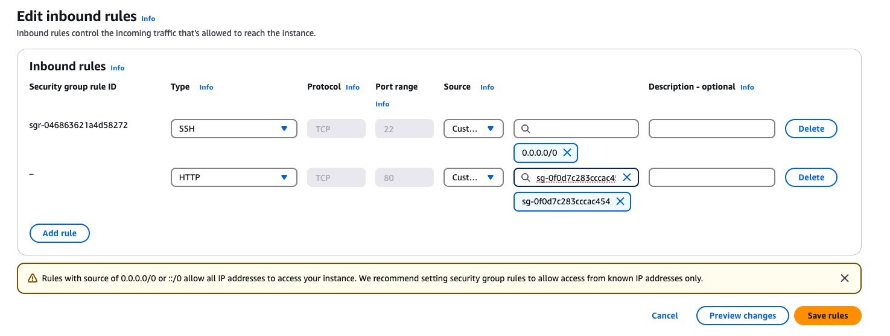

A més a més, també es pot accedir a les instàncies EC2 a través de SSH que esta exposat a internet. Aquesta configuració pot ser un risc de seguretat, ja que els atacants podrien intentar accedir a les vostres instàncies EC2 a través de SSH. Un forma de solucionar es configurar una VPN que ens permeti adminsitrar els nostres recursos. D'aquesta forma, tindrem un únic punt d'entrada a la nostra *intranet* i podrem accedir als nostres recursos de forma segura.

## EC2 per desplegar el servidor VPN

Per desplegar el servidor VPN, crearem una nova instància EC2 que actuarà com a servidor VPN. Aquesta instància EC2 haurà d'estar en una subxarxa pública connectada a interent. 

1. Navegueu a la consola de AWS i seleccioneu el servei **EC2**. A la barra lateral, seleccioneu **Instances** i després **Launch Instances**.
2. Seleccioneu la imatge **Ubuntu Server 22.04 LTS**.
3. Seleccioneu la instància **t2.micro**.
4. Configureu la instància:
    - **Network**: AMSA-VPC
    - **Subnet**: Front-01
    - **Auto-assign Public IP**: Enable

    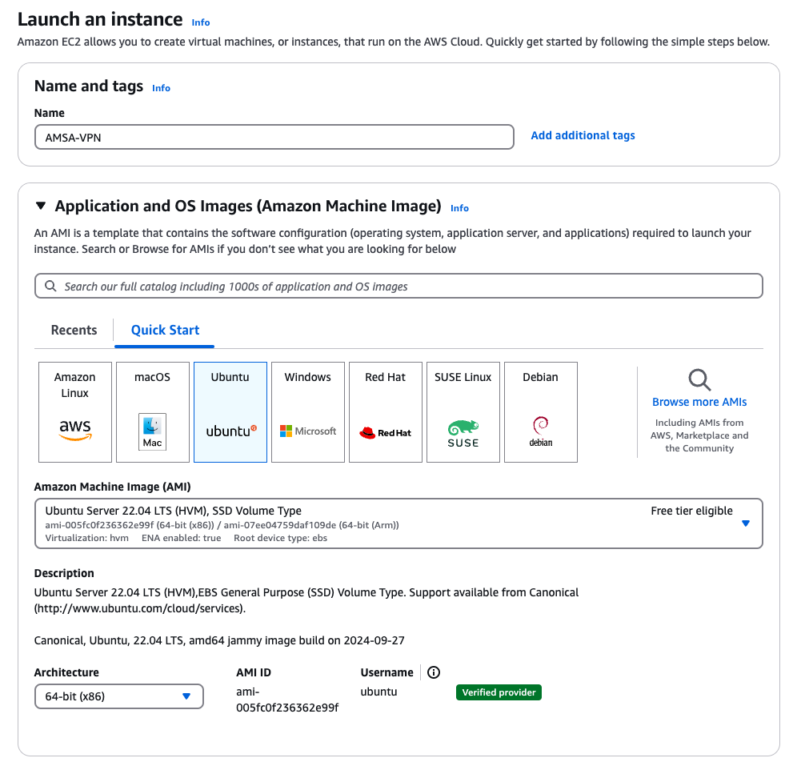

5. Configureu el grup de seguretat: **AMSAVPN-SG**.

    Si reviseu la documentació d'instal·lació del servidor OpenVPN: [OpenVPN Access Server System Administrator Guide ](https://openvpn.net/images/pdf/OpenVPN_Access_Server_Sysadmin_Guide_Rev.pdf). Veure que necessitem els següents ports oberts: **TCP 443, TCP 943, UDP 1194**.

    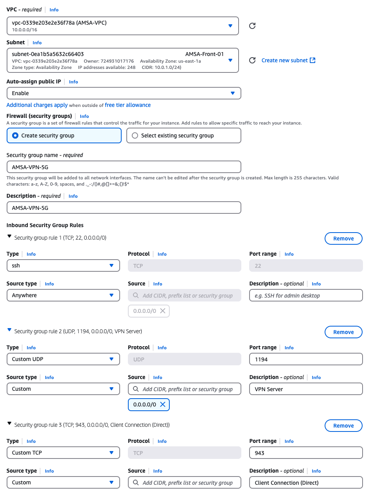

6. Connecteu-vos a la instància EC2 a través de la consola online de AWS o amb una connexió SSH i executeu la següent comanda per instal·lar el servidor OpenVPN:

    ```bash
    sudo apt update -y
    sudo apt install ca-certificates gnupg wget net-tools -y
    sudo wget https://as-repository.openvpn.net/as-repo-public.asc -qO /etc/apt/trusted.gpg.d/as-repo-public.asc
    sudo echo "deb [arch=amd64 signed-by=/etc/apt/trusted.gpg.d/as-repo-public.asc] http://as-repository.openvpn.net/as/debian jammy main" | sudo tee /etc/apt/sources.list.d/openvpn-as-repo.list
    sudo apt update && sudo apt install openvpn-as -y
    ```

    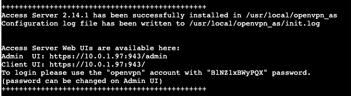

7. Amb aquestes credencials, podreu accedir a la interfície web del servidor OpenVPN a través del vostre navegador web. Navegueu a la IP pública de la instància EC2 (en el meu cas https://44.199.196.242:943/admin), com no tenim el certificat SSL configurat, ens sortirà un missatge d'advertència, ignoreu-lo i continueu. Inicieu sessió amb les credencials que heu configurat anteriorment.

    > Nota: Si heu perdut les credencials de l'usuari `openvpn`, les podeu recuperar consultat el fitxer de logs del servidor OpenVPN. Per exemple, podeu consultar el fitxer de logs amb la següent comanda:
    >
    > ```bash
    > sudo less /usr/local/openvpn_as/init.log 
    > ```

    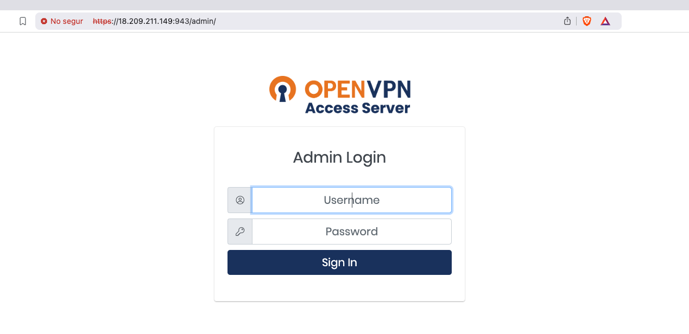

    - Accepteu els termes de llicència.
  
    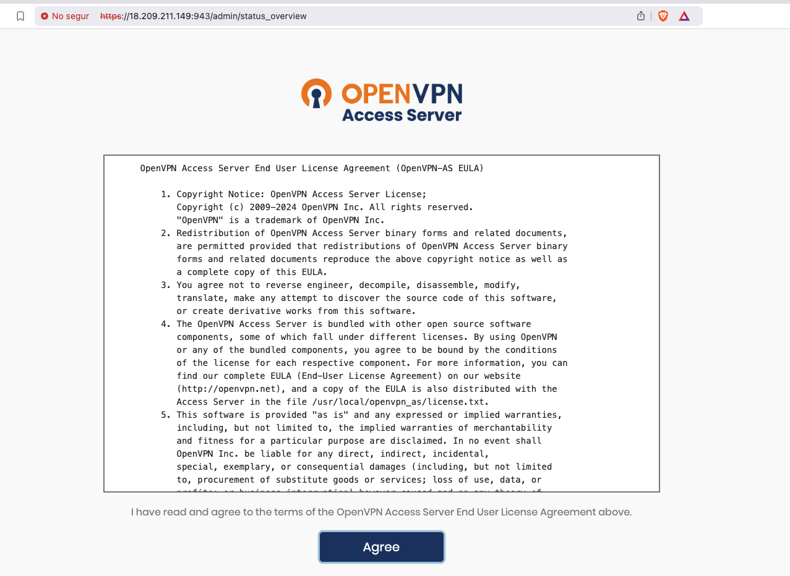

    - Aneu a **Network Settings** i configureu la IP pública de la instància EC2 com a **Hostname or IP Address**.

    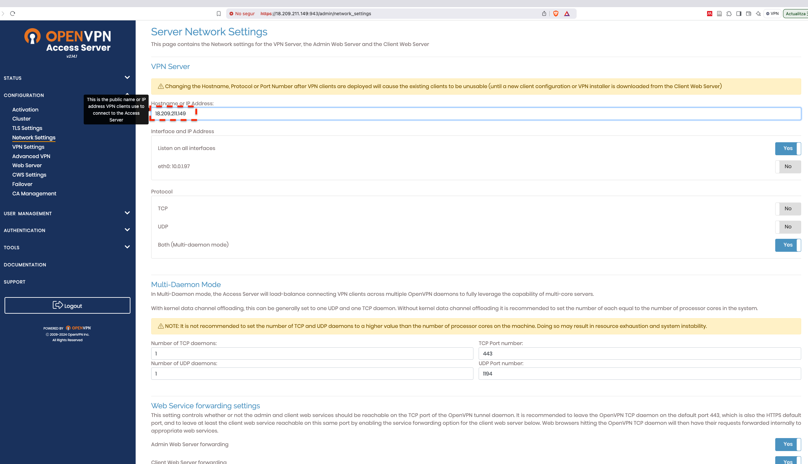

    - Aneu a **VPN Settings** a la secció de *Routing* i afegiu les subxarxes de la VPC que voleu accedir a través de la VPN i també poseu a **NO** *Should client Internet traffic be routed through the VPN?* per evitar que tot el tràfic del client sigui redirigit a través de la VPN.

    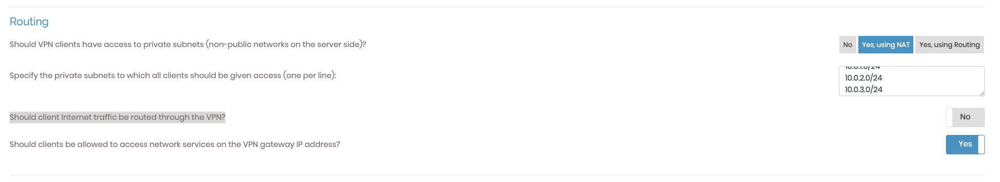

    > **IMPORTANT**: Guardeu els canvis i actualitzeu el servidor OpenVPN. Un cop fet us desconectareu de la interfície web i al recarregar-la, haureu de tornar a iniciar sessió.

8. Un cop realitzada la configuració, descarregueu el client OpenVPN Connect per al vostre sistema operatiu i també accediu a la interfície web per descarregar el fitxer de configuració del client.

    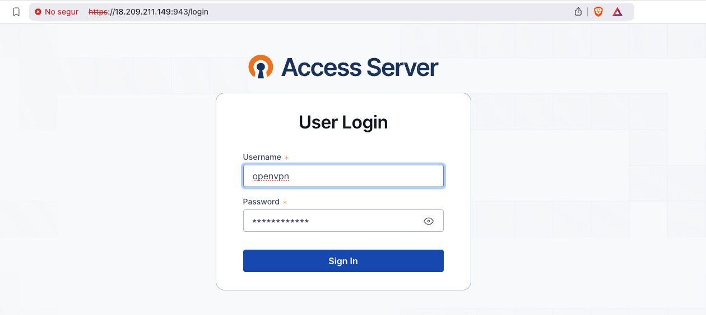

9.  Un cop loguejats, descarregueu el fitxer de configuració del client i importeu-lo a l'aplicació OpenVPN Connect.

    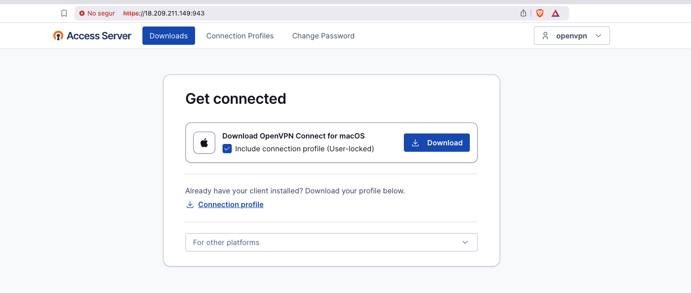

10. Un cop descarregat el client, importeu el fitxer de configuració del client a l'aplicació OpenVPN Connect i connecteu-vos al servidor VPN.

    > **Nota**: Si no teniu la vostra clau ssh, a les instancies EC2, és el moment de setejar-la. Simplement copieu la vostra clau pública ssh al fitxer `~/.ssh/authorized_keys` de l'usuari `ubuntu` a la instància EC2 on teniu la VPN, i el mateix als usuaris `ec2-user` de la resta de màquines.

11. Un cop tot configurat, actualitzarem el grup de seguretat de les instàncies EC2 per permetre el tràfic al port 22 únicament provinent del servidor VPN. Això significa que les instàncies EC2 només acceptaran tràfic SSH del servidor VPN i no de qualsevol altre origen.

    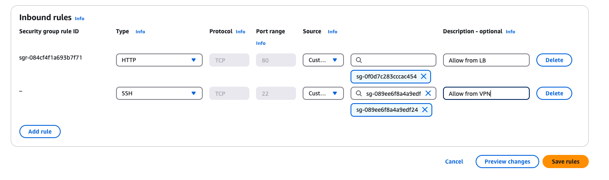

En aquest punt, ja no podreu accedir a les instàncies EC2 on teniu el servei de WordPress a través de SSH, ja que el tràfic SSH només es permet des del servidor VPN. Per accedir a les instàncies EC2, primer heu de connectar-vos al servidor VPN i després connectar-vos a les instàncies EC2. Per fer-ho:

- Importeu el fitxer de configuració del client OpenVPN Connect a l'aplicació i connecteu-vos al servidor VPN.
  
    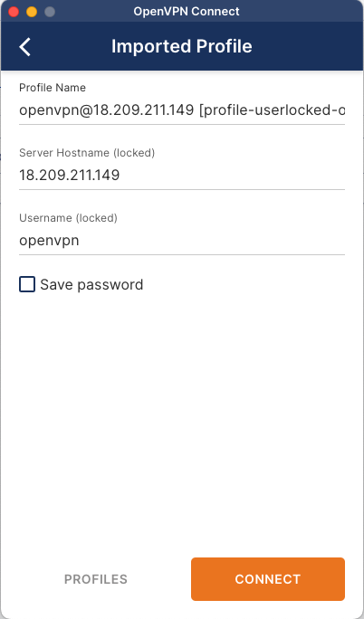

    > **TroubleShooting**: Si en el fitxer de configuració veieu (**Server Hostname**) una ip del rang 10.0.X.X, això vol dir que la VPN no s'ha configurat correctament. Assegureu-vos de reiniciar el servidor i tornar a descarregar el fitxer de configuració del client, ha de tenir la ip pública del servidor VPN.

- Utilitzeu la mateixa contrasenya del usuari `openvpn` per connectar-vos al servidor VPN.

    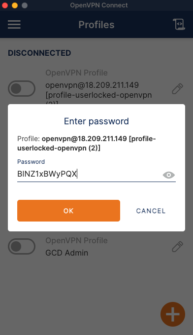

- Si tot ha anat bé, veureu que esteu connectats al servidor VPN.

    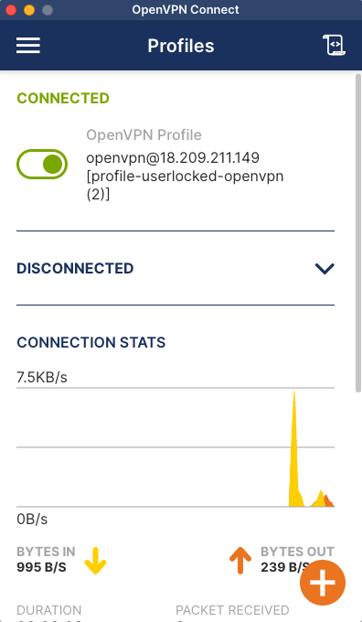
  
Finalment, connecteu-vos a les instàncies EC2:

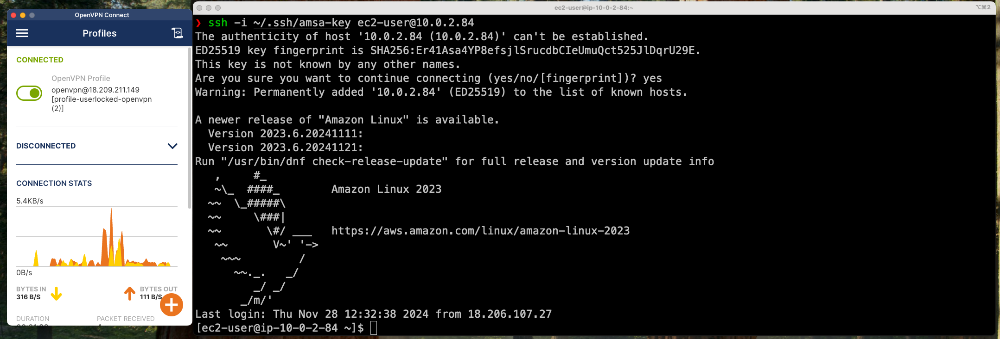

> **Consideracions importants**: El servidor VPN ens permet accedir a les instàncies EC2 a través de SSH, però a partir de l'adreça interna (10.0.X.X) de la instància EC2. No podrem accedir a les instàncies EC2 a través de la seva adreça pública ja que hem configurat la VPN per accedir a les subxarxes de la VPC.

## Millores

- Es podria millorar aquesta configuració evitant l'accés a l'interfície web del servidor OpenVPN a través de la IP pública i requerir l'accés a través de la VPN.
- Es podria configurar usuaris i grups per gestionar l'accés a la VPN de forma més granular.
