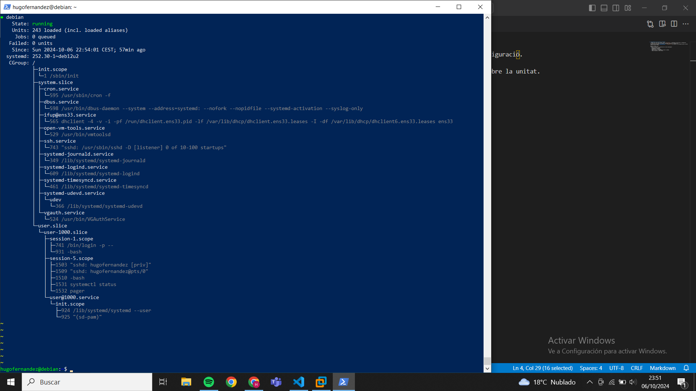
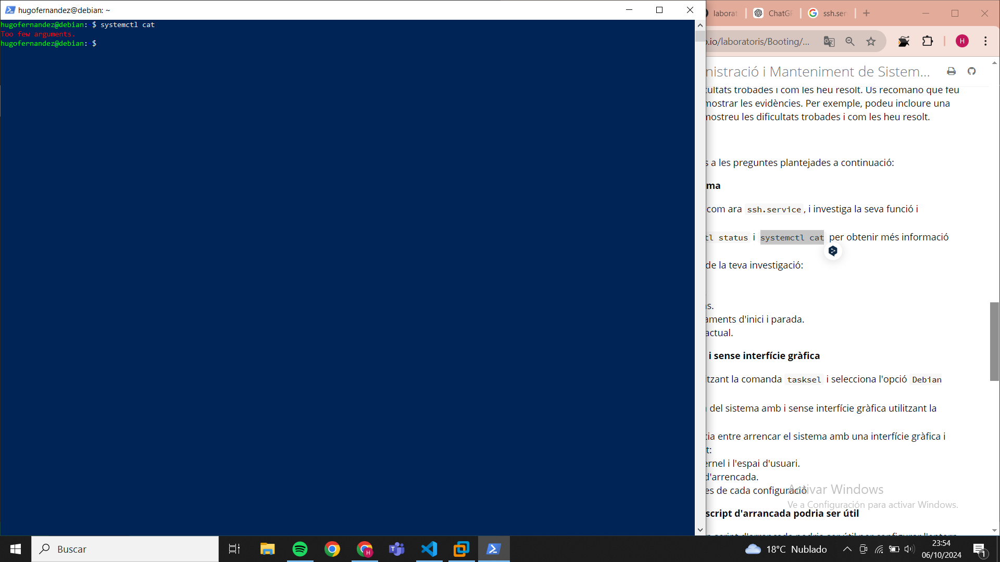

1. **Investigació d'una unitat del sistema**
   - Elegeix una unitat del sistema, com ara `ssh.service`, i investiga la seva funció i configuració.

   La funció del ssh és poder-se connectar remotament mitjançant el protocol ssh tal i com ho fem amb la maquina virtual i la powershell de windows.

   - Utilitza les comandes `systemctl status` i `systemctl cat` per obtenir més informació sobre la unitat.

   Comanda systemctl status:
   

   Comanda systemctl cat:
   

   - Inclou a l'informe  els resultats de la teva investigació:
     - Descripció de la unitat.

     És el servei del servidor SSH (Secure Shell) en SO Linux gestionat per systemd, com he comentat abans, és un protocol de xarxa que permet la connexió segura a ordinadors remots.

     - Documentació associada.

     Alguna documentació la podem trobar en enllaços com ara:
     https://www.openssh.com/manual.html
     https://wiki.archlinux.org/title/OpenSSH_(Espa%C3%B1ol)

     - Dependències i condicions.

    Aquest servei té dues dependències: network.target i sshd-keygen.service.

    Com a condicions trobem que el servei només s'iniciarà si les condicions de xarxa es compleixen i que aquest ha d'estar habilitat per arrencar automàticament si es vol accedir al servidor SSH en iniciar el sistema.
    

     - Tipus de servei i comandaments d'inici i parada.

     El tipus de servei és simple, és a dir, el systemd el considera actiu fins que és dete de manera explícita.

     Comandament inci --> sudo systemctl start ssh.service

     Comandament final --> sudo systemctl stop ssh.service

     - Temps d'execució i estat actual.

     Com es pot veure en imatge el temps d'execució es de 57 minuts i el seu estat actual és running.